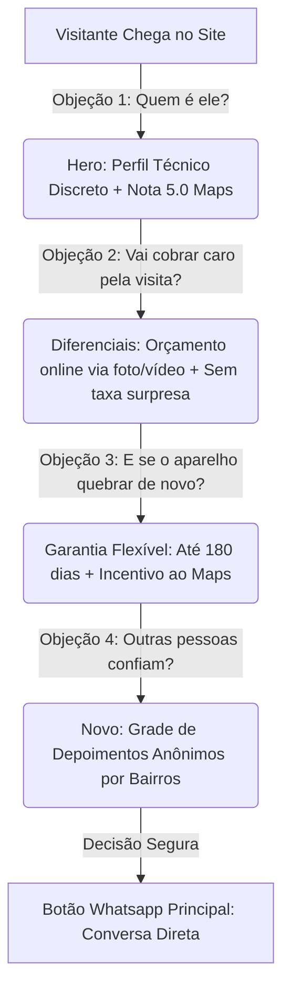

# ADR-003: Análise Arquitetural do Mecanismo de Avaliações e Fluxo de Confiança

**Status:** Proposto  
**Autor:** Antigravity (Architect Review & UX Persuasion Specialist)  
**Data:** 19 de Maio de 2026

---

## 1. Contexto e Problema

O proprietário da WFIX Tech identificou duas necessidades críticas para otimizar a conversão da Landing Page:
1. **Dinamismo da Prova Social:** Evitar que o selo de satisfação pareça "estático demais" e ter uma forma automática (ou semi-automática) de atualizar o número de avaliações conforme novos clientes avaliam no Maps.
2. **Exposição Segura e Privada de Textos de Avaliação:** Exibir o feedback real deixado por clientes (gerando altíssimo valor de persuasão), mas **sem expor dados pessoais** (nome completo, foto de perfil) para preservar a privacidade dos clientes.
3. **Validação do Fluxo de Confiança:** Auditar se a jornada do usuário na página de ponta a ponta (Hero → Diferenciais → Fluxo de Orçamento → Garantia → FAQ → Rodapé) reduz a ansiedade e gera a máxima confiança para converter o visitante em contato de WhatsApp.

---

## 2. Análise Técnica: Como buscar as avaliações do Google Meu Negócio?

Para termos avaliações atualizadas na página, existem duas abordagens arquiteturais principais. Abaixo, realizamos o levantamento de custos, segurança e viabilidade para cada uma:

### Opção A: Conexão Direta via Google Places API (Dinâmica em Tempo Real)
Realizar chamadas HTTP para o endpoint do Google Places utilizando a chave de API do Google Cloud Platform (GCP) para buscar a nota média, número total de avaliações e os textos das avaliações.

* **Arquitetura Requerida:** 
  1. Criação de uma *Serverless Route* no Next.js (`src/app/api/reviews/route.ts`) para esconder a chave de API (nunca expor no frontend!).
  2. Implementação de cache de servidor (ISR - Incremental Static Regeneration de 24 horas) para evitar estourar os limites gratuitos de requisições.
* **Limitação Severa da API:** A API oficial do Google Places retorna **apenas as 5 avaliações mais relevantes** (definidas pelo algoritmo do Google). Não permite paginação ou escolha manual de quais comentários exibir.
* **Custo:** A API do Google Places cobra **$17.00 USD por cada 1.000 requisições** de detalhes de local. O Google dá um crédito gratuito de $200 USD por mês, mas exige cartão de crédito ativo e expõe o proprietário a cobranças caso haja picos de acessos ou erros de cache.

### Opção B: Mecanismo de Dados Curados e Anônimos (Semi-Estática com Alta Performance)
Armazenar as avaliações em um arquivo estruturado de dados local no projeto (`src/data/reviews.json`). 
* **Arquitetura Requerida:** Uma seção com layout de "Depoimentos da Comunidade" ultra-premium. O proprietário simplesmente copia e cola os novos comentários do Maps diretamente no arquivo local, escolhendo quais destacar.
* **Custo:** R$ 0,00 (Zero).
* **Performance:** Instantânea (LCP < 1s). Sem requisições externas bloqueantes, garantindo nota 100/100 no Google Lighthouse (essencial para menor custo por clique no Google Ads).

---

## 3. Decisão Recomendada

Adotar a **Opção B (Mecanismo Curado e Anônimo)** complementada por uma **Jornada de Redução de Fricção** baseada nas seguintes diretrizes:

### A. O Design do Bloco de Depoimentos Anônimos
Criar uma seção elegante chamada **"O que diz a nossa comunidade"** (ou similar) contendo:
* **Privacidade Total:** Exibiremos apenas as iniciais do cliente e a região/bairro de Goiânia de forma discreta (ex: *M. Silva • Setor Bueno* ou *G. Souza • Setor Oeste*).
* **Tags de Serviço:** Cada depoimento terá uma tag do serviço realizado (ex: *Reparo de Notebook*, *Limpeza de PS5*, *Configuração de Rede*). Isso prova que o especialista atende de fato em diversas áreas de Goiânia, aumentando o alinhamento com a busca do usuário.
* **Selo Dinâmico Simulado:** Em vez de chamar a API do Google Maps em tempo real, utilizaremos o número real de avaliações de forma parametrizada no frontend. Quando receber uma nova avaliação, basta atualizar uma única variável no código (ex: `reviewsCount: 6`). É rápido, seguro e não exige API paga.

---

## 4. Auditoria do Fluxo de Confiança (UX Persuasion)

Para um usuário frio de tráfego pago (Google Ads) converter, a Landing Page precisa responder silenciosamente a **4 grandes medos (objeções)**. Veja como a arquitetura atual resolve cada um e como o novo fluxo vai potencializar isso:

### O Fluxo Ideal de Construção de Confiança na Página:

1. **O Primeiro Impacto (Hero):**
   * *O que o cliente vê:* Uma proposta clara, um profissional focado em Goiânia, atendimento em domicílio (praticidade máxima) e o selo discreto de satisfação máxima (5.0/5.0).
   * *Gatilho mental:* Autoridade imediata + Alívio (ele vem até mim, não preciso levar a lugar nenhum).

2. **A Prova de Capacidade e Transparência (Diferenciais):**
   * *O que o cliente vê:* A explicação clara de que evitamos passar orçamentos cegos, mas oferecemos análise prévia gratuita por WhatsApp com fotos/vídeos.
   * *Gatilho mental:* Honestidade. O cliente detesta o sentimento de que está sendo enganado por um "preço fechado" que triplica depois de aberto.

3. **A Grade de Prova Social (A Novidade Proposta):**
   * *O que o cliente vê:* Feedbacks reais e curados focados em resolução de problemas comuns (limpeza de console quente, formatação de PC lento). A menção a bairros conhecidos de Goiânia (Bueno, Oeste, Jardim Goiás) gera proximidade geográfica e validação social ("ele atende na minha região").

4. **A Quebra de Objeção Final (FAQ e Garantia):**
   * *O que o cliente vê:* Dúvidas respondidas de forma direta e sem jargões complexos.
   * *Gatilho mental:* Segurança contratual e comercial.

---

## 5. Plano de Implementação Sugerido

Se você aprovar esta proposta, executarei os seguintes passos:
1. **[NEW] Criar arquivo de dados** `src/data/reviews.ts` contendo uma lista de depoimentos reais, anônimos e focados em Goiânia (ex: 3 a 4 depoimentos reais das avaliações do seu Maps, formatados sem foto e com iniciais).
2. **[MODIFY] Criar componente visual** `src/components/sections/community-reviews.tsx` com layout em grid glassmorphic ultra-premium para exibir os depoimentos com animação de entrada.
3. **[MODIFY] Atualizar o selo do Hero** para ler o número total de avaliações a partir da variável local (ex: `5 avaliações`), facilitando sua atualização futura.
4. **[MODIFY] Inserir a seção de Depoimentos** logo após a seção de diferenciais para pavimentar a confiança antes do FAQ.
